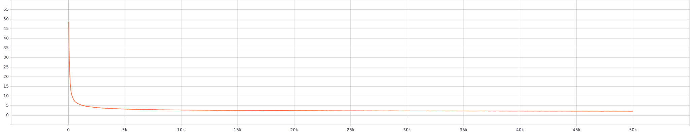

# TransE-PyTorch
Implementation of TransE [[1]](#references) model in PyTorch.

## Table of Contents
1. [Results](#results)
    1. [Datasets](#datasets)
        1. [FB15k](#fb15k)
2. [Usage](#usage)
    1. [Training](#training)
        1. [Options](#options)
    2. [Unit tests](#unit-tests)
3. [References](#references)

## Results

### Datasets

#### FB15k

| Source/Metric  | Hits@1 (raw) | Hits@3 (raw) | Hits@10 (raw) | MRR (raw) |
| ---------------| ------------ | ------------ | ------------- | --------- |
| Paper [[1]](#references) | X | X | 34.9 | X |
| TransE-PyTorch | 11.1 | 25.33 | **46.53** | 22.29 |

```bash
python3 main.py --dataset_path=<path_to_fb15k_dataset> --epochs=50000 --batch_size=128
```

##### Negative sampling impact over time



X axis - epoch id

Y axis - % of samples with nonzero loss
 
## Usage

### Synthetic data
For fast debugging/feedback loop use synthetic data from [synth_data](synth_data) directory.
```bash
python3 main.py --nouse_gpu
```
### Training
```bash
python3 main.py --nouse_gpu --dataset_path=<path_to_your_dataset>
```
#### Options
To see possible configuration options run help
```bash
python3 main.py --help
```
### Unit tests
```bash
python3 -m unittest discover -p "*_test.py"
```

## References
[1] [Bordes et al., "Translating embeddings for modeling multi- relational data," in Adv. Neural Inf. Process. Syst., 2013](http://papers.nips.cc/paper/5071-translating-embeddings-for-modeling-multi-relational-data.pdf)
